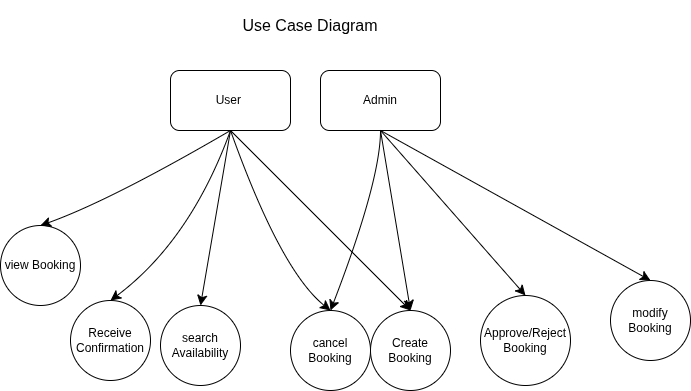

# requirement-analysis
### Requirement Analysis in Software Development

This repository is dedicated to exploring the process of requirement analysis in software development. It contains resources, examples, and documentation that demonstrate how to gather, document, and analyze software requirements effectively. The goal is to provide a foundational understanding of this critical phase in the software development lifecycle, which helps ensure that the final product meets user needs and expectations.
------------
## What is Requirement Analysis?

Requirement Analysis is a crucial phase in the Software Development Lifecycle (SDLC) that involves identifying, gathering, and defining the functional and non-functional requirements of a software system. This process ensures that all stakeholders have a clear understanding of what the software is expected to do and provides a solid foundation for designing and building the system.

During this phase, business analysts, project managers, developers, and clients collaborate to determine the system’s goals, user needs, constraints, and operational environment. Techniques such as interviews, questionnaires, use cases, and workflow analysis are commonly used to extract and document these requirements.

### Importance of Requirement Analysis in SDLC:

- **Clarity and Understanding:** It bridges the gap between stakeholders and developers by clearly outlining expectations and objectives.
- **Project Planning:** Accurate requirements help in estimating time, cost, and resources effectively.
- **Risk Reduction:** Early identification of potential issues or misunderstandings can save time and cost later in the development process.
- **Quality Assurance:** Well-defined requirements contribute to building software that meets user needs and performs reliably.
- **Scope Management:** It prevents scope creep by documenting agreed-upon features and functionalities.

In essence, requirement analysis is the blueprint for successful software development. It ensures that the final product aligns with the user's expectations and business goals.
------------
## What is Requirement Analysis?

Requirement Analysis is the process of identifying, documenting, and managing the needs and requirements of stakeholders for a software system. It serves as the foundation of the software development lifecycle (SDLC) by establishing what the system should do, how it should perform, and the constraints it must operate under.

This process involves gathering information from stakeholders, users, and domain experts through interviews, surveys, observations, and document analysis. The goal is to translate business needs into clear, actionable software requirements that developers and designers can use to build the system.

### Importance of Requirement Analysis in SDLC

Requirement Analysis plays a critical role in the success of any software project. Here’s why it is important:

- **Defines Project Scope:** It helps in outlining the boundaries of the project, ensuring all stakeholders agree on what will be delivered.
- **Improves Communication:** Clear requirements enhance communication between clients, developers, testers, and other team members.
- **Minimizes Rework:** Detecting and fixing requirement issues early reduces costly changes during development or after deployment.
- **Supports Planning and Estimation:** Accurate requirements allow better time, cost, and resource estimations.
- **Ensures Quality:** Well-defined and validated requirements are essential for building software that meets user expectations and performs reliably.

In summary, Requirement Analysis ensures that the software product is aligned with business goals and user needs, reducing the risk of failure and enhancing overall project success.

---------------------
## Why is Requirement Analysis Important?

Requirement Analysis is a critical step in the Software Development Lifecycle (SDLC) because it lays the groundwork for the entire project. Properly analyzing and documenting requirements ensures that the final product meets user expectations, stays within budget, and is delivered on time. Here are three key reasons why Requirement Analysis is essential:

### 1. Prevents Miscommunication and Misunderstanding

By clearly defining what the software should do, Requirement Analysis minimizes the risk of miscommunication between stakeholders and development teams. It ensures everyone has a shared understanding of the project goals, which helps avoid confusion and conflicting expectations.

### 2. Saves Time and Cost

Identifying requirements early in the development process reduces the need for costly changes later. Well-defined requirements help in creating accurate project plans, allowing teams to allocate resources effectively and avoid unnecessary rework or delays.

### 3. Improves Product Quality

Requirement Analysis helps ensure that the final product meets the user’s actual needs. By understanding user goals and system constraints upfront, developers can design solutions that are functional, efficient, and user-friendly, leading to higher satisfaction and better overall quality.

In essence, Requirement Analysis acts as a roadmap that guides the entire development process, helping teams deliver successful and sustainable software solutions.
------------------
## Key Activities in Requirement Analysis

Requirement Analysis involves a series of structured activities that help in understanding and defining what a software system must accomplish. Below are the five key activities involved in this process:

- **Requirement Gathering**  
  This activity focuses on collecting information from stakeholders, end-users, and other sources to understand their needs and expectations. Methods include interviews, questionnaires, observations, and reviewing existing documentation.

- **Requirement Elicitation**  
  Elicitation goes deeper into understanding the gathered information by engaging with stakeholders to clarify, refine, and uncover hidden or implied requirements. Techniques such as brainstorming sessions, workshops, and use case development are often used.

- **Requirement Documentation**  
  Once requirements are gathered and elicited, they are documented in a clear, structured, and organized manner. Common formats include Software Requirement Specifications (SRS), user stories, and use cases, ensuring that all requirements are recorded and traceable.

- **Requirement Analysis and Modeling**  
  In this step, requirements are analyzed for feasibility, consistency, completeness, and clarity. Modeling tools like flowcharts, data flow diagrams (DFDs), and UML diagrams are used to represent requirements visually and identify potential gaps or conflicts.

- **Requirement Validation**  
  Validation ensures that the documented requirements accurately reflect stakeholder needs and are achievable within the project constraints. This involves reviewing requirements with stakeholders, conducting walkthroughs, and performing validation tests to confirm correctness and completeness.

These activities work together to ensure that software requirements are clearly defined, well understood, and agreed upon by all stakeholders before development begins.
----------------------
## Types of Requirements

In software development, requirements are generally categorized into two main types: Functional requirements and Non-functional requirements. Both are essential for the successful design and implementation of a software system.

### Functional Requirements

Functional Requirements define what the system should do. They describe the specific behaviors, tasks, or functions the system must perform to support user needs and business objectives.

**For a Booking Management Project, examples include:**

- Users must be able to create, view, update, and cancel bookings.
- The system must allow users to search for available booking slots based on date, time, or location.
- Admin users must be able to approve, reject, or modify booking requests.
- The system must send email confirmations to users after a booking is made.
- Users must be able to log in and view their booking history.

### Non-functional Requirements

Non-functional Requirements define how the system performs its functions. These include performance, usability, reliability, security, and other quality attributes that impact the user experience.

**For a Booking Management Project, examples include:**

- The system should be available 99.9% of the time (high availability).
- Response time for search queries should be less than 2 seconds under normal load.
- The application must be accessible on both desktop and mobile devices.
- All user data must be encrypted in transit and at rest to ensure privacy and security.
- The system should support at least 500 concurrent users without performance degradation.

Understanding both types of requirements ensures that the software not only works correctly but also meets quality expectations and user satisfaction.
------------------------
## Use Case Diagrams

Use Case Diagrams are a type of behavioral diagram used in software engineering to visually represent the interactions between users (actors) and the system. They help in identifying the system’s functionalities (use cases) from the user’s perspective and are valuable during the requirement analysis phase.

### Benefits of Use Case Diagrams

- **Clarify system scope:** Clearly define what the system should do.
- **Improve communication:** Provide a simple and intuitive way for stakeholders to understand how users will interact with the system.
- **Identify actors and interactions:** Helps pinpoint user roles and their relationships with different parts of the system.
- **Aid in planning and documentation:** Serve as a reference for developers and testers throughout the development lifecycle.

### Booking Management System - Use Case Diagram

The diagram below represents a basic use case for a booking management system. It includes key actors such as "User" and "Admin" and common use cases like creating, modifying, and managing bookings.

